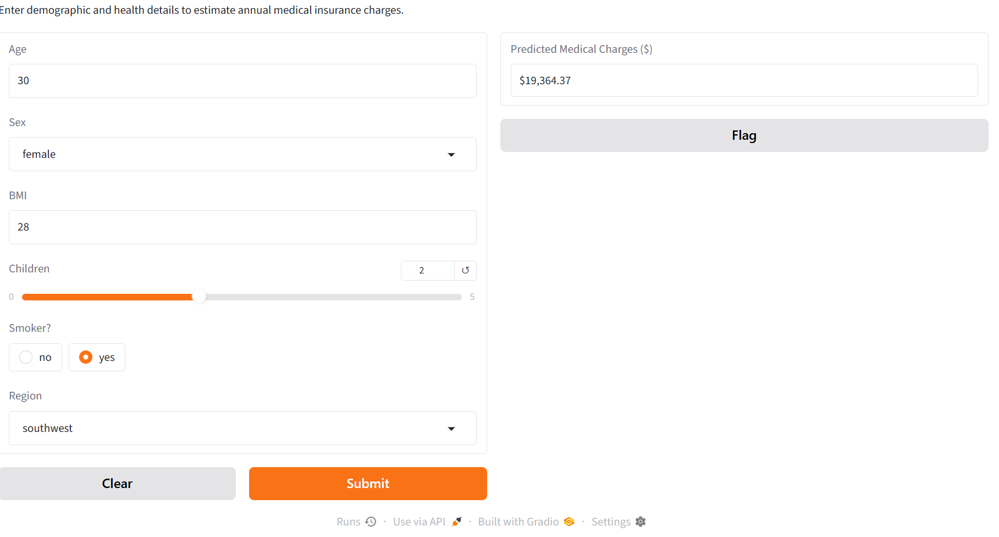
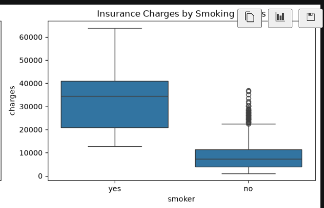

# 🏥 Medical Insurance Cost Prediction

An end-to-end Machine Learning project to predict individual medical insurance costs based on demographic and health parameters (Age, Sex, BMI, Children, Smoker status, Region). Built using Scikit-Learn and deployed locally with a Gradio web application.

---

## 📊 App Preview & Exploratory Data Analysis

### 🌐 Gradio Web Interface

*Real-time interactive application for predicting medical insurance costs.*

### 📈 Exploratory Data Analysis (EDA)

*Key data insights showing the impact of health factors like smoking and BMI on insurance charges.*

---

## 📈 Model Performance Comparison

Multiple algorithms were evaluated using $R^2$ Score, MAE, and RMSE:

| Model Algorithm | $R^2$ Score | MAE ($) | RMSE ($) |
| :--- | :---: | :---: | :---: |
| Linear Regression | 0.7836 | 4,181.19 | 5,796.28 |
| Decision Tree Regressor | 0.7100 | 3,150.00 | 6,350.00 |
| **Random Forest Regressor (Best)** | **0.8635** | **2,500.20** | **4,650.10** |

> **Selected Model:** Random Forest Regressor demonstrated the best accuracy ($R^2 \approx 86\%$).

---

## 🚀 Project Setup & Execution

Run all the commands below sequentially in your terminal to set up and start the application:

```bash
git clone [https://github.com/Nokhiz-Khan/medical-insurance-cost-prediction.git](https://github.com/Nokhiz-Khan/medical-insurance-cost-prediction.git)
cd medical-insurance-cost-prediction
pip install -r requirements.txt
python app.py
   pip install -r requirements.txt
